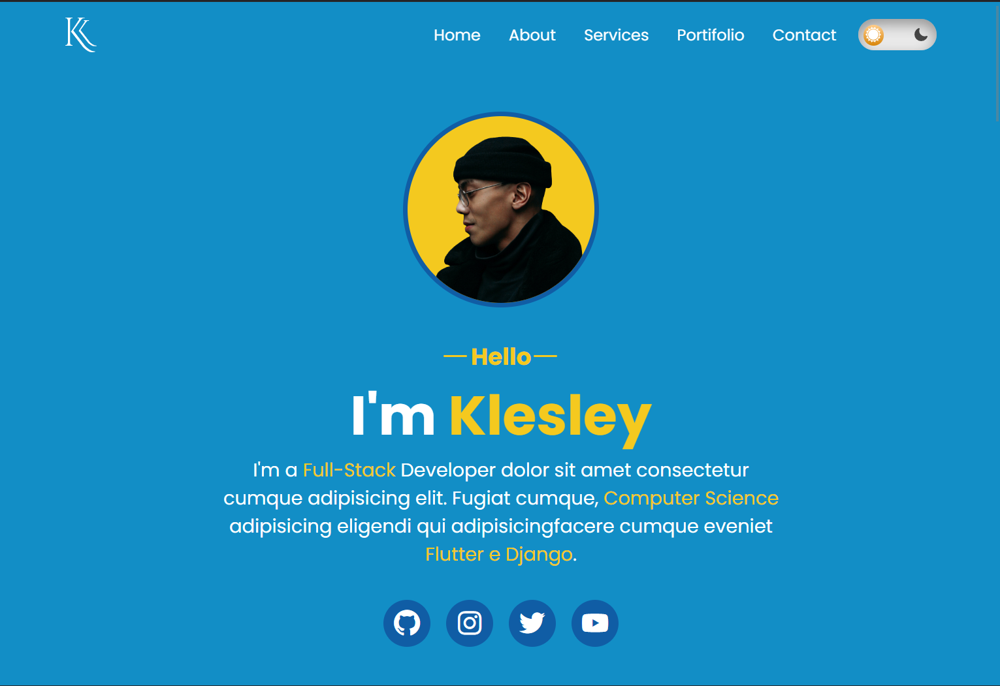
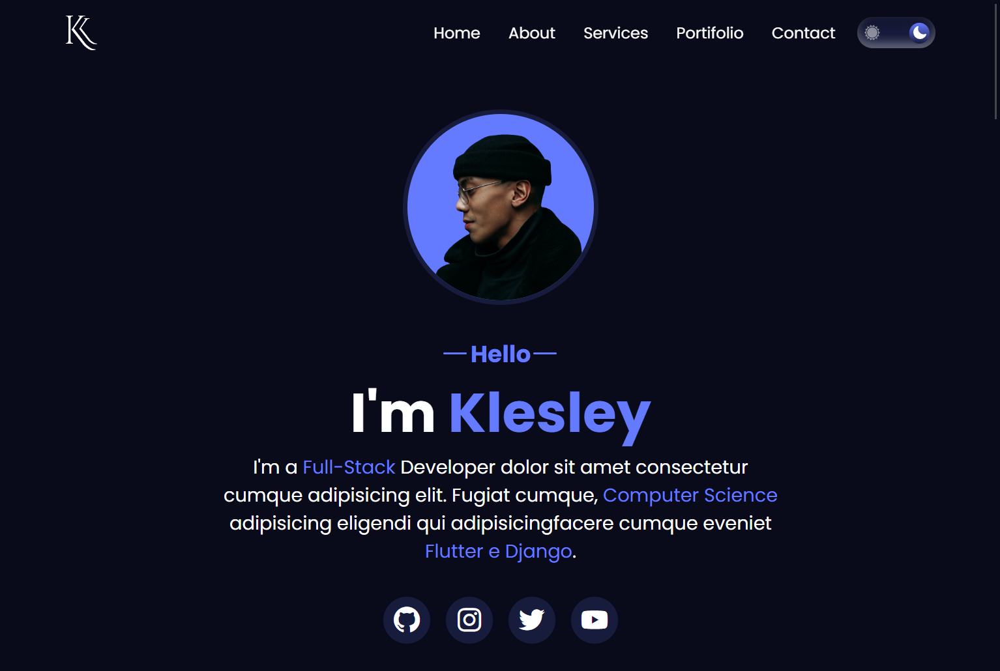
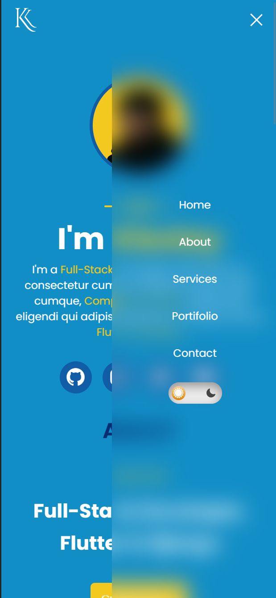
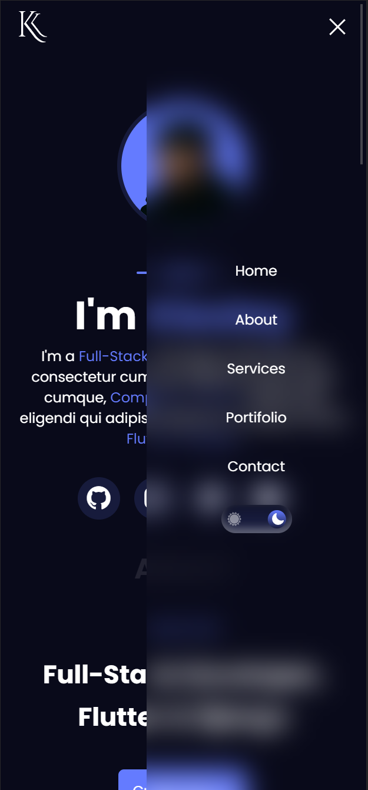

# Portifolio

Portifolio is a responsive website created for showcasing professional work and services. It has been designed to look great on all kinds of devices, from desktop computers to mobile phones. The application can be tested at the link https://imklesley.github.io/portifolio/.

## Project Images

    
        
        
    
     
    
        
        
     

More Images on the folder /github/assets/

## Features

* Multi-theme - light and dark modes available
* Responsive design
* Home, about, services, reviews, portifolio and contact sections
* Glassmorphism effect on drawer menu and web menu
* SwiperJS library for the reviews section
* EmailJS library for contact form
* SweetAlertJS library for alerts

## Dependencies - Using CDN

* [SwiperJS](https://swiperjs.com/) - Used in the review section
* [EmailJS](https://www.emailjs.com/) - Used to send an email when the contact form is filled
* [SweetAlertJS](https://sweetalert.js.org/) - Used to show alerts if the email was sent or if there is something wrong with the contact form

## Usage

1. Clone the repository
2. Run the project opening the index.html

##

Developed by Klesley Gonçalves

